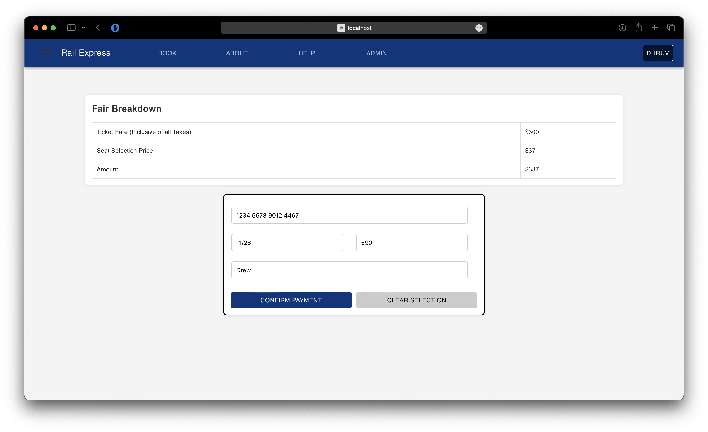

# Rail Express: Train booking System Web Application
This comprehensive full-stack application utilizes Java Spring Boot and ReactJS, powered by Node v12.0.0 and npm v7.19.0. The integration of Google OAuth ensures robust authentication, complemented by efficient SQL data management through Workbench. The outcome is an intuitive and user-friendly interface that streamlines the Train booking and management process. Elevate your travel experience with this seamlessly integrated solution.

<br/>

## Installation and Setup Instructions
Clone down this repository. You will need `node` and `npm` installed globally on your machine.

### Installation:
Install npm modules:
```bash
npm install
```

Installing the database component for React:
```bash
npm install react-data-table-component
```

To Start Server:
```bash
npm start
```

To Visit App:
```bash
localhost:3000
```

<br/>

In case of any errors (ensure the number of vulnerabilities is less than 10 - sometimes running twice helps!):
```bash
npm audit fix --force
```

<br/>

**Note:** Landing page is `home.jsx`. Add all routes in it.

<br/>

## Queries Creation
Run the queries in `insert_query.txt` to create Trains and seats for passengers. Modify this as per Trains and requirements.

<br/>

## Creating google authentication
1. Login to [Google Cloud Console](https://console.cloud.google.com/).
2. Go to **APIs & Services**, and click on **Credentials** in the left pane.
3. Click on **Create Credentials** and select **OAuth Client ID request**.
4. Select the application type as **Web Application** and give it a name.
5. Provide Authorized JavaScript origins as:
   - http://127.0.0.1:3000
   - http://localhost:3000
6. Provide Authorized redirect URIs as:
   - http://127.0.0.1:3000/callback
   - http://localhost:3000/callback

<br/>

## Frontend Web Pages
#### Train Search Page


<br/>

#### Google Authentication for Secure Login


<br/>

#### Seat Selection
- Black: Booked
- Green: Selected
- Gray: Available
 

<br/>

#### Payment Page
 

<br/>

#### Train Seat Booking Confirmation
 

<br/>

#### Manage Bookings
 

<br/>

#### Admin Pages
 
 
  

<br/>
